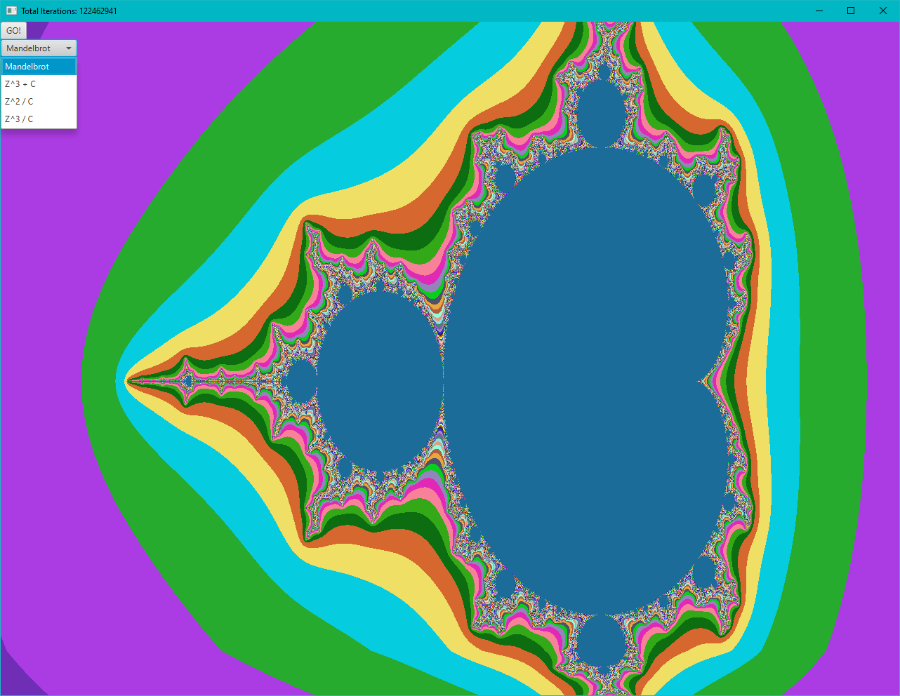
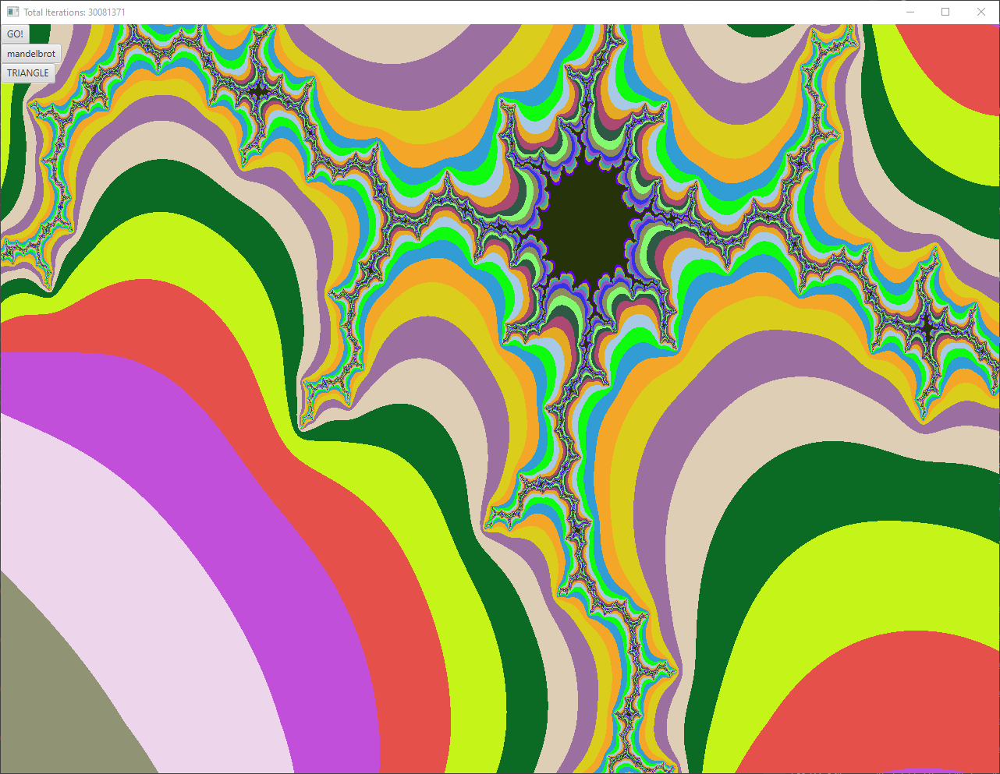
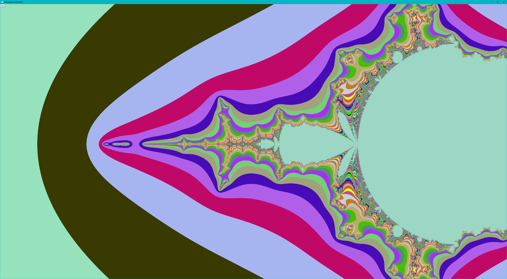

# jfx-fractal
Java FX Fractal Generator

Uses JDK16 Records for performance, and thus requires JDK16 in order to compile and run.

## Features
 - ### Click-to-Center (left-click in order to center the viewport on the left-clicked part of the fractal)
 - ### Panning (w,a,s,d)
 - ### Zooming (scroll-wheel)
 - ### Color Shading
 - ### Resizable
 - ### Multi-Threaded - Uses both chunking and multi-threading to render quickly.
 - ### Dynamic Class Loading
   - Create your own classes extending `org.example.equations.IFractalEquation`, and JFX-Fractal will pick them up automatically.
   - Your custom equation class must be in the `org.example.equations` package.
 

### Project Genesis
The following Maven command was used to generate the initial structure of this project:
 - `mvn archetype:generate \
-DarchetypeGroupId=org.openjfx \
-DarchetypeArtifactId=javafx-archetype-simple \
-DarchetypeVersion=0.0.3 \
-DgroupId=org.openjfx \
-DartifactId=sample \
-Dversion=1.0.0 \
-Djavafx-version=15.0.1`

### Contributing
Interested in contributing? Drop me a line @ cpress.scott@gmail.com, or send a pull request.

### Latest Project Screenshots
- 06/02/2021 
- 05/22/2021 
- 05/08/2021 